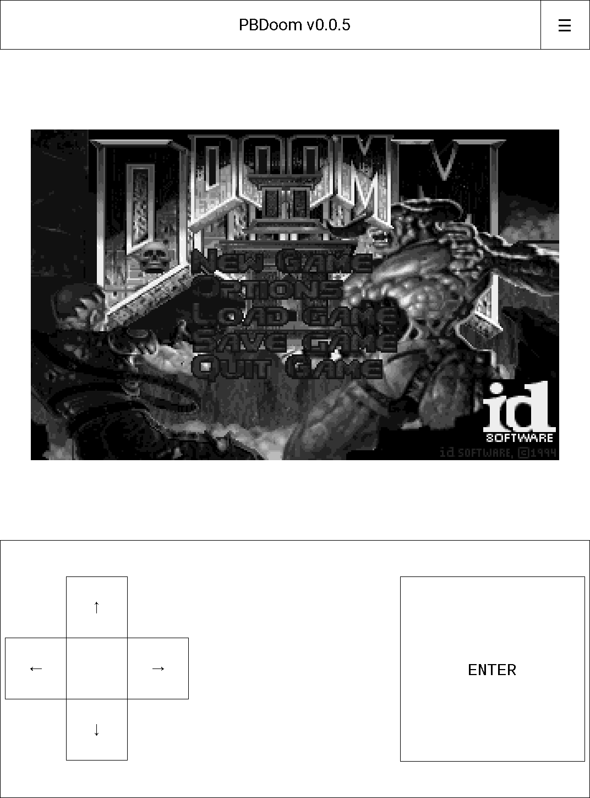
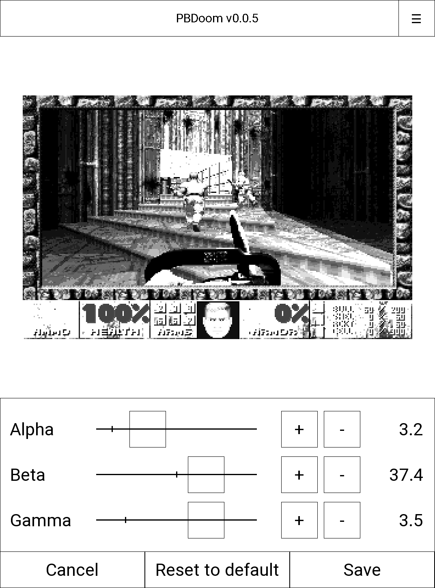
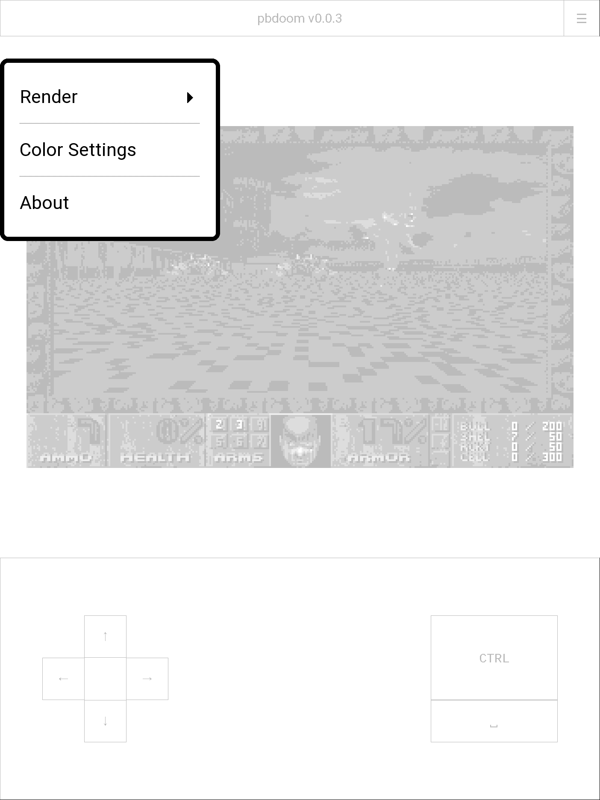

# PBDoom
Doom for PocketBook eInk devices.



## Installation
1. Download the game from the releases page https://github.com/imustafin/pbdoom/releases
2. Unzip the archive to the `applications` directory on the ereader.
3. Place your WADs in the `applications/pbdoom` directory. WAD filenames should
   be in lower case (not `DOOM2.WAD` but `doom2.wad`)
4. You should have this structure:
  ```
  applications
  ├── pbdoom
  │   ├── doom2.wad
  │   ├── game.app
  └── pbdoom.app
  ```
5. Run the game using the `pbdoom` icon from the ereader applications menu

## Development process
The following describes a development process for building the game on Linux.

### Building
1. Obtain the SDK (we use https://github.com/pocketbook/SDK_6.3.0/tree/5.19)
2. Write the path to SDK to `sdk_path` (e.g. `../SDK_6.3.0-6.3.2/SDK-A13`)
3. Run `./build.sh`
  * The executable `game.app` will be located in the `build` dir

### App sender-receiver
To make the development more convenient we can use the approach of
https://github.com/pmartin/pocketbook-demo/tree/master/app-sender-receiver

The general idea is to use `nc` to exchange data between the development computer
and the ebook.

After building the executable we can send it to the device using `send.sh`.

Helper program `pbdoom-get.app` receives the executable sent by `send.sh`,
runs the game and redirects the output to the computer using `nc`.

To see the output from `pbdoom-get.app` have `mon.sh` running.

Don't forget to update ip addresses and ports in all scripts.

Check the ereader's ip in wifi settings for the connected network.

### Releasing
1. Choose the release version (e.g. `0.0.1`)
2. Update the changelog
    1. Change `[Unreleased]` title to the version (`[0.0.1]`)
    2. Make a new `[Unreleased]` title with `### Added` and `### Fixed`
    3. At the end of file, add link for the release (`[0.0.1] .../compare/v0.0.0...v0.0.1`)
    4. Update the `[unreleased]` link (`[unreleased]: .../compare/v0.0.1...HEAD`)
3. Push changelog updates to `main`
4. Grab the artifact
5. Make a GitHub release
    1. Set the version, add `v` prefix (`v0.0.1`)
    2. Paste changelog of the release
        * Don't add the release title (already shown by GitHub)
        * Make headings (Added, Fixed) start from `h1` (`#`)
